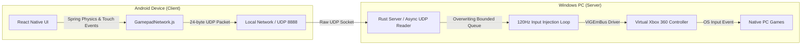

<div align="center">

# 🎮 ZapGamepad — PadX

**Turn your Android phone into a low-latency Xbox 360 controller for your PC.**

No cables. No pairing dance. Just scan a QR code and play.

[](https://www.rust-lang.org/)
[](https://expo.dev/)
[](#)
[](#-custom-binary-udp-protocol)
[](#-license)

<br/>


</div>

---

## 📚 Table of Contents

- [Overview](#-overview)
- [Features](#-features)
- [System Architecture](#-system-architecture)
- [Components](#-components)
- [Binary UDP Protocol](#-custom-binary-udp-protocol)
- [Getting Started](#-getting-started)
- [Tech Stack](#-tech-stack)
- [Roadmap](#-roadmap)
- [License](#-license)

---

## 🕹️ Overview

**PadX** is a real-time virtual gamepad system. It pairs a React Native touch UI on Android with a Rust host server on Windows, streaming input over raw UDP and injecting it into a kernel-level virtual Xbox 360 controller via **ViGEmBus** — so any game that supports a physical Xbox controller works out of the box.

---

## ✨ Features

- ⚡ **Low-latency input** — ~60Hz client send rate, 120Hz server injection loop
- 🕹️ **Spring-physics joysticks** — snap-back-to-center feel with haptic feedback
- 🔌 **Zero-handshake networking** — raw UDP, no connection setup overhead
- 📷 **QR code pairing** — scan straight from the server console to connect
- 🎮 **True virtual controller** — kernel-level emulation via ViGEmBus, indistinguishable from a physical Xbox 360 pad
- 💾 **Auto IP persistence** — client remembers your last host IP via `AsyncStorage`
- 🖱️ **Linear pointer mode** — disables Windows pointer acceleration during mouse emulation, restores it on exit
- 🛡️ **Fail-safe neutralization** — inputs zero out automatically if no packet arrives within 100ms

---

## ⚡ System Architecture



---

## 🧩 Components

### 1. Mobile Client — `client/`

| | |
|---|---|
| **Framework** | React Native + Expo |
| **UI/UX** | Custom joystick built on the `Animated` API with spring physics and snap-back on release, paired with haptic feedback |
| **Network** | Raw binary UDP packets sent to port `8888` at ~60Hz |
| **Persistence** | Last successfully connected host IP saved via `AsyncStorage` |

### 2. Host Server — `server/`

| | |
|---|---|
| **Language** | Rust — `tokio` for async I/O, `crossbeam-channel` for lock-free queuing |
| **Driver Integration** | Emulates a physical Xbox 360 controller at the kernel level via **ViGEmBus** |
| **Discoverability** | Auto-detects the PC's local IPv4 address and renders a scannable QR code in the console |
| **Pointer Handling** | Temporarily disables Windows "Enhance Pointer Precision" during mouse emulation, restores on exit |
| **Injection Loop** | Dedicated 120Hz thread draining the input queue; neutralizes state after 100ms of silence |

---

## 📑 Custom Binary UDP Protocol

To keep overhead minimal, the client transmits a tightly packed **24-byte** structure per frame:

| Byte Offset | Type  | Field            | Description |
| :---------- | :---- | :--------------- | :----------- |
| `0`         | `u8`  | `magic`          | Header validation signature (`0x47`) |
| `1`         | `u8`  | `version`        | Protocol version (`0x01`) |
| `2`         | `u8`  | `player_id`      | Assigned player ID (local multiplayer support) |
| `3`         | `u8`  | `flags`          | Special state flags |
| `4–7`       | `u32` | `sequence`       | Incremental sequence ID — drops stale, out-of-order packets |
| `8–9`       | `u16` | `buttons`        | Bitmask of Xbox 360 face / utility buttons |
| `10–11`     | `i16` | `left_stick_x`   | Left stick X-axis (`-32768` → `32767`) |
| `12–13`     | `i16` | `left_stick_y`   | Left stick Y-axis (`-32768` → `32767`) |
| `14–15`     | `i16` | `right_stick_x`  | Right stick X-axis (`-32768` → `32767`) |
| `16–17`     | `i16` | `right_stick_y`  | Right stick Y-axis (`-32768` → `32767`) |
| `18`        | `u8`  | `left_trigger`   | Left trigger analog (`0` → `255`) |
| `19`        | `u8`  | `right_trigger`  | Right trigger analog (`0` → `255`) |
| `20–23`     | `u32` | `timestamp`      | Client timestamp (ms) |

<details>
<summary><strong>Button Bitmasks</strong> (click to expand)</summary>

```rust
// TODO: fill in bitmask constants, e.g.
// const BTN_A: u16      = 1 << 0;
// const BTN_B: u16      = 1 << 1;
// const BTN_X: u16      = 1 << 2;
// const BTN_Y: u16      = 1 << 3;
// const BTN_LB: u16     = 1 << 4;
// const BTN_RB: u16     = 1 << 5;
// const BTN_BACK: u16   = 1 << 6;
// const BTN_START: u16  = 1 << 7;
// const BTN_DPAD_UP: u16    = 1 << 8;
// const BTN_DPAD_DOWN: u16  = 1 << 9;
// const BTN_DPAD_LEFT: u16  = 1 << 10;
// const BTN_DPAD_RIGHT: u16 = 1 << 11;
```

</details>

---

## 🚀 Getting Started

### Prerequisites

- Windows PC with [ViGEmBus driver](https://github.com/ViGEm/ViGEmBus) installed
- Rust toolchain (to build the server)
- Node.js + Expo CLI (to run the client)
- Android device and PC on the **same local network**

### 1. Run the server

```bash
cd server
cargo run --release
```

A QR code will render directly in your console — scan it from the app to connect instantly.

### 2. Run the client

```bash
cd client
npm install
npx expo start
```

Scan the QR code shown in the server console, and you're in.

---

## 🛠️ Tech Stack

| Layer                 | Technology |
| :--------------------- | :--------- |
| Mobile UI              | React Native, Expo |
| Mobile Networking       | Raw UDP sockets |
| Server Runtime          | Rust, Tokio |
| Input Queuing           | crossbeam-channel |
| Controller Emulation    | ViGEmBus |

---

## 🗺️ Roadmap

- [ ] Finalize and document full button bitmask table
- [ ] Multi-controller / local co-op support polish
- [ ] Customizable button layouts
- [ ] Latency/ping indicator in-app
- [ ] iOS client support

---

## 📄 License

Personal project — license TBD.
